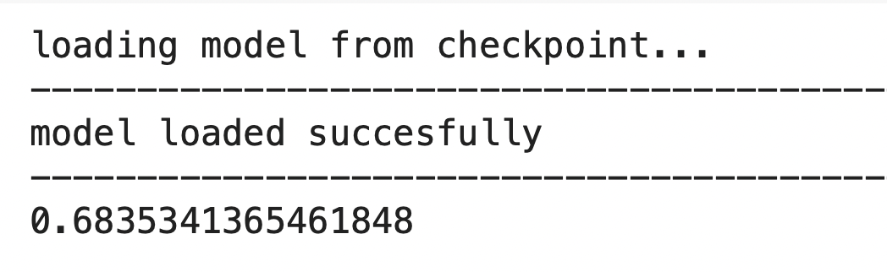

# gpt-neo-for-NLI
This project aims to finetune the GPTNeo 125M from  [Huggingface transformers](https://github.com/huggingface/transformers) on the XNLI french dataset for natural language inference task. 

The XNLI dataset is also loaded from the huggingface dataset library. 

The overal accuracy on the test set after 3 epochs of training on google colab is given below.

